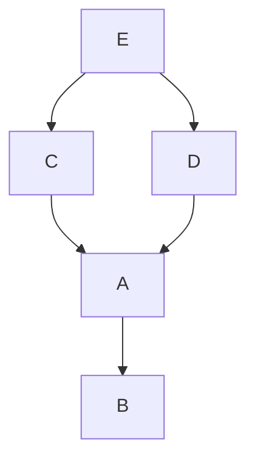
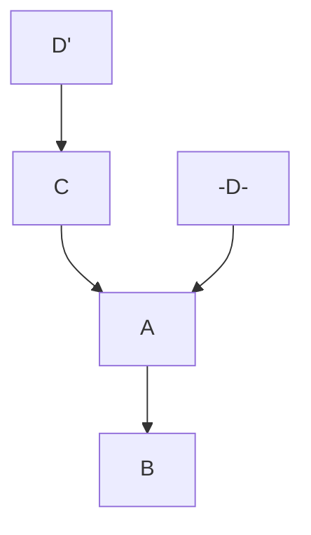

### `Git gc`

垃圾收集

`git gc`

- 将`/.git/refs`文件打包到`/.git/packed-refs`

##### `/.git/obects`

git提交的文件存储，可压缩

### Git裸库

没有工作区的git仓库（服务器端） 

`git init --bare`

- 只生成`.git`里面的配置文件

### `submodule`

- 项目本身依赖其他其他项目（通用库）
  - 被依赖的库打成架包，`maven`等
    - 频繁更新不方便
  - 手工拷贝
    - 版本历史丢失

`git submodule add [module] [module_name]`

- 产生`.gitmodules`  `modules`

- 获取变化
  - 进入目录中，执行`git pull`
- 全部更新
  - `git submodules foreach git pull`

##### `git clone`

- 使用该命令默认不会将`submodule`中代码克隆
- 操作
  - `git submodule init`
  - `git submodule update --recursive`
- 一并拉取
  - `git clone [] --recursive`

### `subtree`

- 主要解决`submodule`双向修改的问题

`git remote add subtree-origin [child_module]`

`git subtree add --prefix=subtree subtree-origin master (--squash)`

`git subtree add --prefix subtree `

`git subtree add -P subtree`

- subtree  
  - 目录
- subtree-origin
  - 远程版本库
- master
  - 分支
- --squash（全部使用或全部不使用）
  - 合并，将多个提交合并到一个提交，防止子仓库污染主仓库
  - 三方合并遇到问题，没有共同提交记录
  - 解决办法提交到其他分支内层仓库合并

`git subtree pull --prefix=subtree subtree-origin master --squash`

###### 对子模块文件操作`push`，子仓库`pull`之后再次提交，父模块拉取产生冲突

- `--squash`在合并时找不到三方合并的信息

`git substree split`

将一个模块代码提取出来作为公共代码（包含对于这个模块的提交历史）

### `Git cherry-pick`（本地分支）

可以将分支的提交应用到其他分支

`git cherry-pick [commit_id]`

- 直接跳着应用可能会产生冲突

### `Git rebase`

变基、衍合，主要功能类似于`merge`，不过二者在工作方式上有本质的区别

`git rebase`原理有些类似于`git-cherry-pick`，该操作会修改提交记录

`merge`

##### `rebase`

参数：

- `git rebase --skip`丢弃补丁信息，以目标分支信息为准
- `git rebase --abort`放弃变基

注意事项：

- 该操作会产生冲突，解决冲突后，使用`git add`添加，然后执行`git rebase --continue`
- `git rebase --abort`终止`rebase`，分支会恢复到`rebase`开始前的状态
- 不要对`master`分支执行该命令
- `rebase`应用的分支应该是未推送到远程版本库的分支

