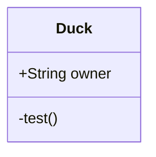

[返回](../Mermaid.md)

# ClassDiagrams

类图用来描述了系统的类集合，类的属性和类之间的关系。

[类图补充](classDiagram.md)

### 类

`class`

`ClassName:[Visibility] attribute`

`ClassName:[Visibility] function`

### 成员

- `className: [Visibility][member]`

- `class className`
	`{`
	`+String owner`
	`+despoite() `
	`}`

### 返回值

`+method() ReturnType`

### 泛型

`List~int~`

### 标识

- `+` Public
- `-` Private
- `#` Protected
- `~` Package/Internal

> 同时可以通过在方法后面添加符号来表不同的信息
>
> - `*` Abstract e.g.: `someAbstractMethod()*`
> - `$` Static e.g.: `someStaticMethod()$`

### 关系

`[classA][Arrow][ClassB]:LabelText`

> LabelText:
>
> implements
>
> composition
>
> association

| Type  | Description   |
| ----- | ------------- |
| <\|-- | Inheritance   |
| *--   | Composition   |
| o--   | Aggregation   |
| -->   | Association   |
| --    | Link (Solid)  |
| ..>   | Dependency    |
| ..\|> | Realization   |
| ..    | Link (Dashed) |

### 基数和多样性

`[classA] "cardinality1" [Arrow] "cardinality2" [ClassB]:LabelText`

- `1` Only 1
- `0..1` Zero or One
- `1..*` One or more
- `*` Many
- `n` n {where n>1}
- `0..n` zero to n {where n>1}
- `1..n` one to n {where n>1}

### 类注释

`class className`

`Annotation className`

`Annotation`

- `<<Interface>>` 
- `<<abstract>>` 
- `<<Service>>` 
- `<<enumeration>>` 

`class Shape{    <<interface>>    noOfVertices    draw() }`

### 交互

略