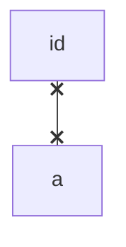
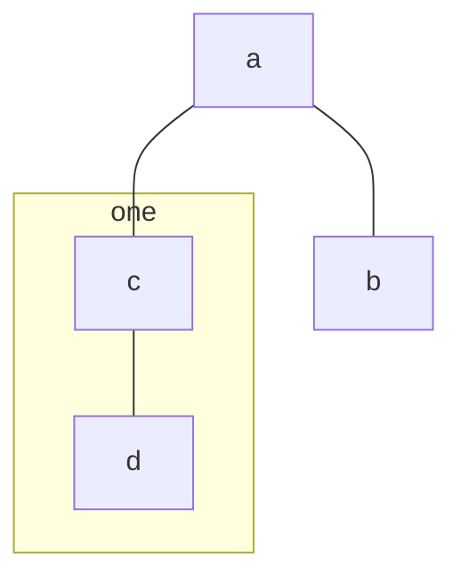
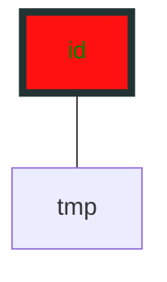

[返回](../Mermaid.md)

# Flowchart

> graph [oriented];
>
> 导向分类：
>
> 由上到下（`TD` 或 `TB`）
>
> 由左到右（`LR`）


### 结点

- `[]`

  ```mermaid
  graph TB;
  id[text]
  ```

  

- `()`

  ```mermaid
  graph TB;
  id(text)
  ```

  

- `([])`

  ```mermaid
  graph TB;
  id([text])
  ```

```
	
- `[[]]`
	
  ```mermaid
  graph TB;
  id[[text]]
```

```
	
- `[()]`
	
  ```mermaid
  graph TB;
  id[(text)]
```

- `(())`

  ```mermaid
  graph TB;
  id((text))
  ```

- `>]`

  ```mermaid
  graph TB;
  id>text]
  ```

- `{}`

  ```mermaid
  graph TB;
  id{text}
  ```

- `{{}}`

  ```mermaid
  graph TB;
  id{{text}}
  ```

- `[//]`

  ```mermaid
  graph TB;
  id[/text/]
  ```

- `[\\]`

  ```mermaid
  graph TB;
  id[\text\]
  ```

- `[/\]`

  ```mermaid
  graph TB;
  id[/text\]
  ```

- `[\/]`

  ```mermaid
  graph TB;
  id[\text/]
  ```


### 连线

- `-->`

  ```mermaid
  graph TB;
  id-->id
  ```

- `---`

  ```mermaid
  graph TB;
  id---id
  ```

- `---text!---`

  ```mermaid
  graph TB;
  id---text!---id2
  ```

- `---|text|`

  ```mermaid
  graph TB;
  id---|text|id
  ```

- `-->|text|`

  ```mermaid
  graph TB;
  id-->|text|id
  ```

- `-.->`

  ```mermaid
  graph TB;
  id-.->id
  ```

- `-.text.->`

  ```mermaid
  graph TB;
  id-.text.->id
  ```

- `==>`

  ```mermaid
  graph TB;
  id==>id
  ```

- `==text==>`

  ```mermaid
  graph TB;
  id==text==>id
  ```

- `--> & -->`

  ```mermaid
  graph TB;
  id-->a & b-->c
  ```





### 子图

`subgraph id [title]`

`grap definition`

`end`



> 各个子图之间也可以相互设置关系(`beta`)


### 交互

略


### 样式

`style [name] [attribute:value]`



##### 设置组

`class node className;`

`classDef [attribute:value]`