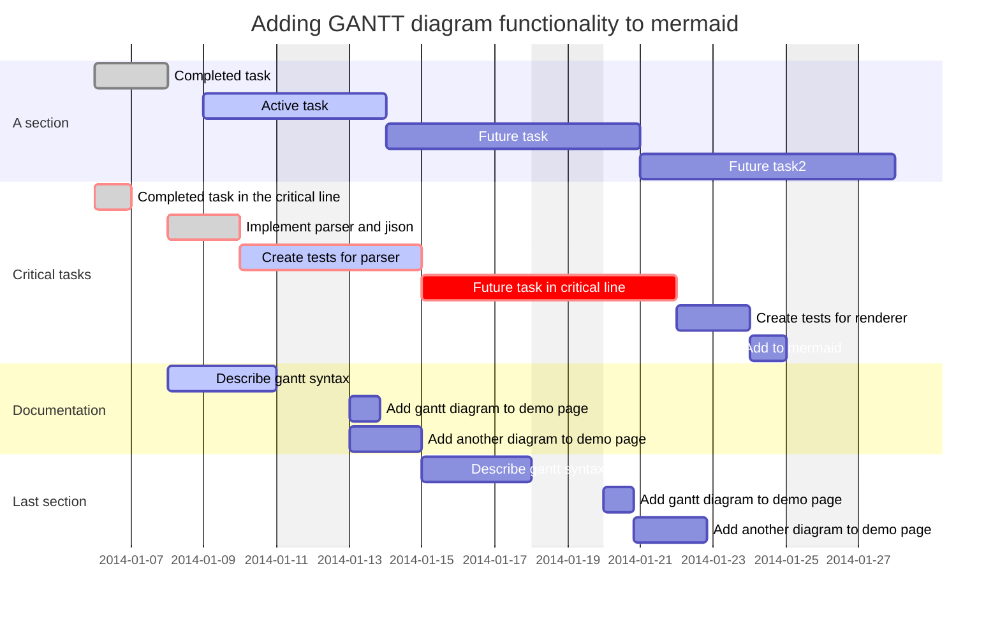

[返回](../Mermaid.md)

# Gantt

说明一个项目进度以及完成任何一个项目所花费的时间

其中`x`轴代表时间，`y` 轴记录不同的任务以及完成任务的顺序

> 注：当要排除某一个任务时，不是通过在删除任务产生空隙而是通过向右扩展相同的天数

### 标题

`title` 标签是一个可选的

### 章节

`section [title for the entire chart]`

### 日期

`dateFormat [format]`

##### 可选的输入格式

| 格式       | 示例             | 描述                        |
| ---------- | ---------------- | --------------------------- |
| `YYYY`     | `2014`           | 4位年                       |
| `YY`       | `14`             | 2位年                       |
| `Q`        | `1..4`           | 季度                        |
| `M MM`     | `1..12`          | 月份                        |
| `MMM MMMM` | `January..Dec`   | `moment.locale（）`中的月份 |
| `D DD`     | `1..31`          | 天数                        |
| `Do`       | `1st..31st`      | 月中第几天                  |
| `DDD DDDD` | `1..365`         | 年中第几天                  |
| `X`        | `1410715640.579` | `Unix`                      |
| `x`        | `1410715640579`  | `Unix ms`                   |
| `H HH`     | `0..23`          | 24小时                      |
| `h hh`     | `1..12`          | 12小时制                    |
| `a A`      | `am pm`          | 中午前后                    |
| `m mm`     | `0..59`          | 分                          |
| `s ss`     | `0..59`          | 秒                          |
| `S `       | `0..9`           | 10秒                        |
| `SS`       | `0..99`          | 100秒                       |
| `SSS`      | `0..999`         | 1000秒                      |
| `Z ZZ`     | `+12:00`         | 设置与`UTC`的偏移量         |

##### 在坐标轴上输出时间

`axisFormat %Y-%m`

##### 

| 格式字符串 | 示例 |
| ---------- | ---- |
| `%a`       | 缩写的工作日名称（“ Sun”） |
| `%A`       | 完整的工作日名称（“星期日”） |
| `%b`       | 缩写的月份名称（“ Jan”） |
| `%B`       | 完整的月份名称（“ January”） |
| `%c`       | 首选的本地日期和时间表示 |
| `%d`       | 每月的某天（01..31） |
| `%e`       | 一年中的某个月（等同于`%-d`） |
| `%H`       | 一天中的小时，24小时制（00..23） |
| `%I`       | 一天中的小时，12小时制（01..12） |
| `%j`       | 一年中的某天（001..366） |
| `%m`       | 一年中的月份（01..12） |
| `%M`       | 小时（00..59） |
| `%L`       | 毫秒（000...999） |
| `%p`       | 子午线指示器（“ AM”或“ PM”） |
| `%S`       | 分钟（00..60） |
| `%U`       | 当年的星期数，从第一个星期日的第一个星期天开始（00..53） |
| `%w`       | 当前年的周数，从第一个星期一作为第一周的第一天开始（00..53） |
| `%W`       | 星期几（星期日为0，0..6） |
| `%x`       | 仅日期显示的首选表示形式，没有时间 |
| `%X`       | 仅用于时间的首选表示形式，无日期 |
| `%y`       | 无世纪的年份（00..99） |
| `%Y`       | 年与世纪 |
| `%Z`        | 时区 |
| `%%`        | "%"字符 |

### 其他

略