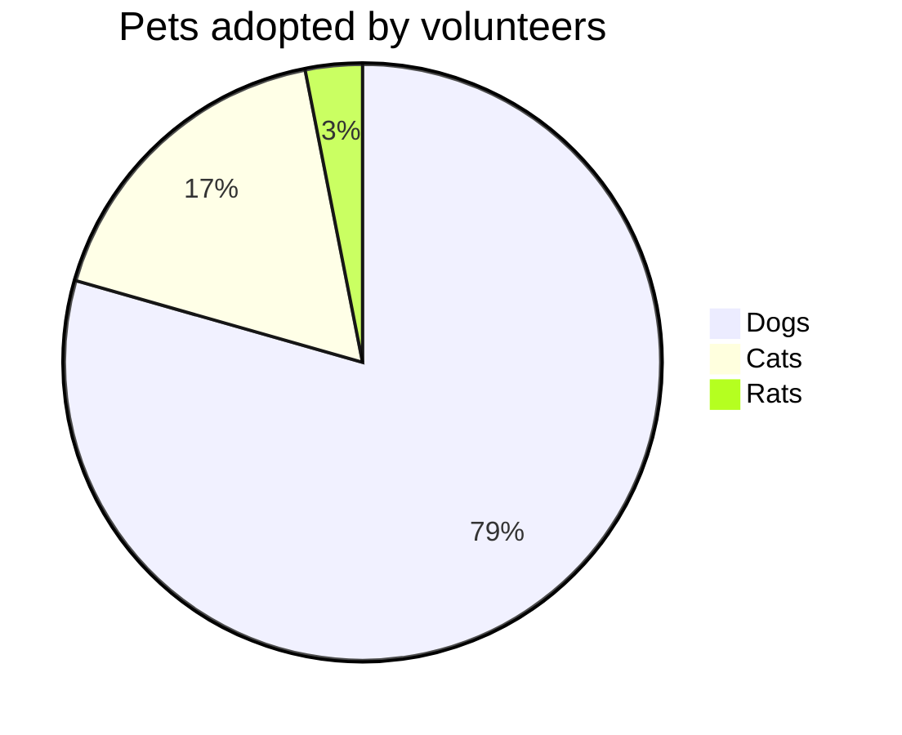

[返回](../Mermaid.md)

# Pie Chart Diagram

### 语法

- 使用 `pie` 关键字
- 使用 `title` 给出主题（可选）
- 设置数据集

`[pie] [title] [titlevalue] (OPTIONAL)`

` "[datakey1]" : [dataValue1] "[datakey2]" : [dataValue2] "[datakey3]" : [dataValue3] . .`

