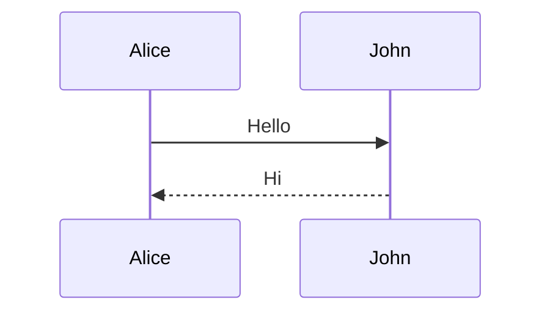
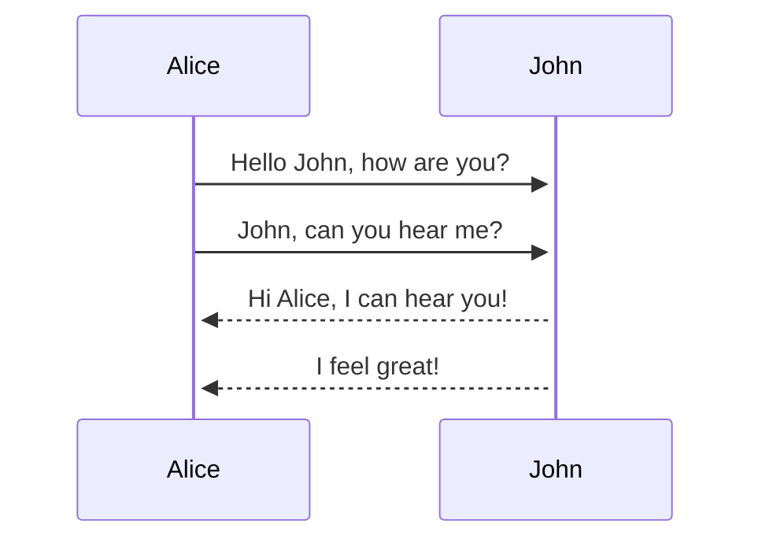
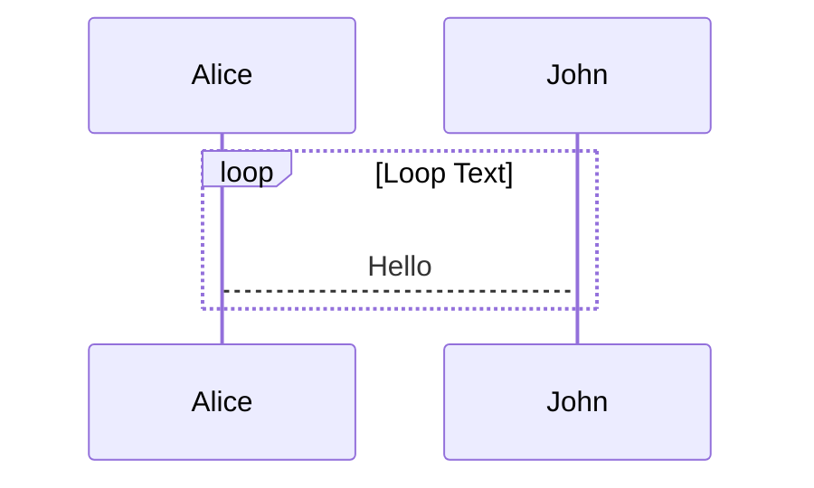
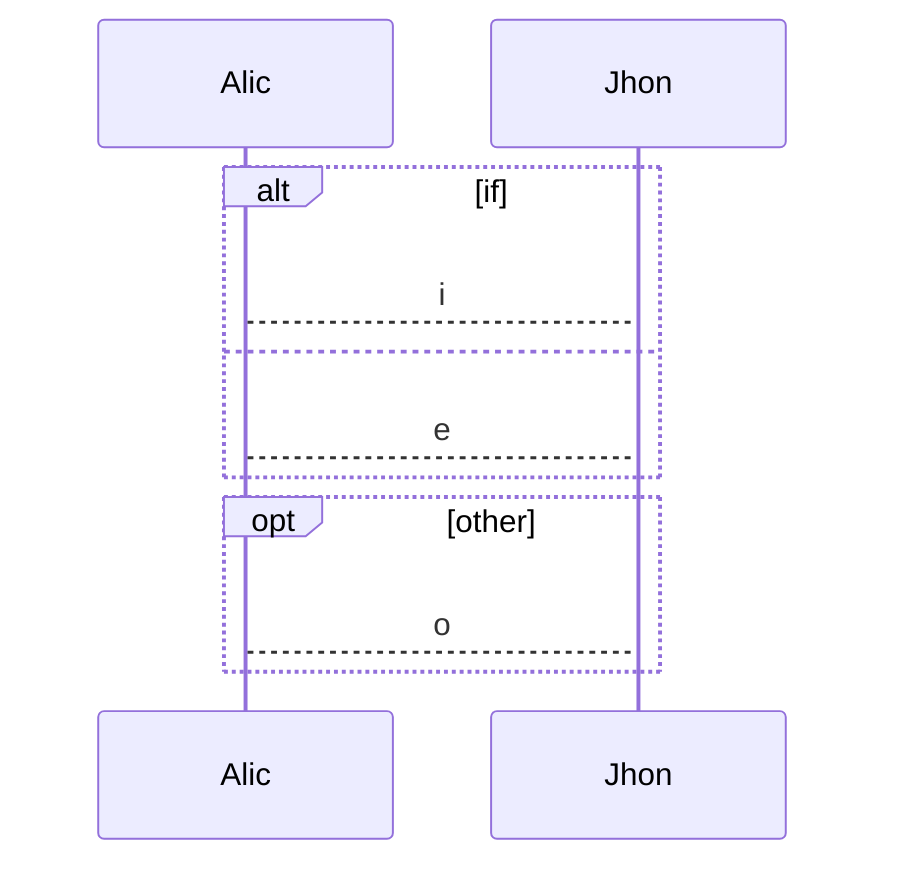
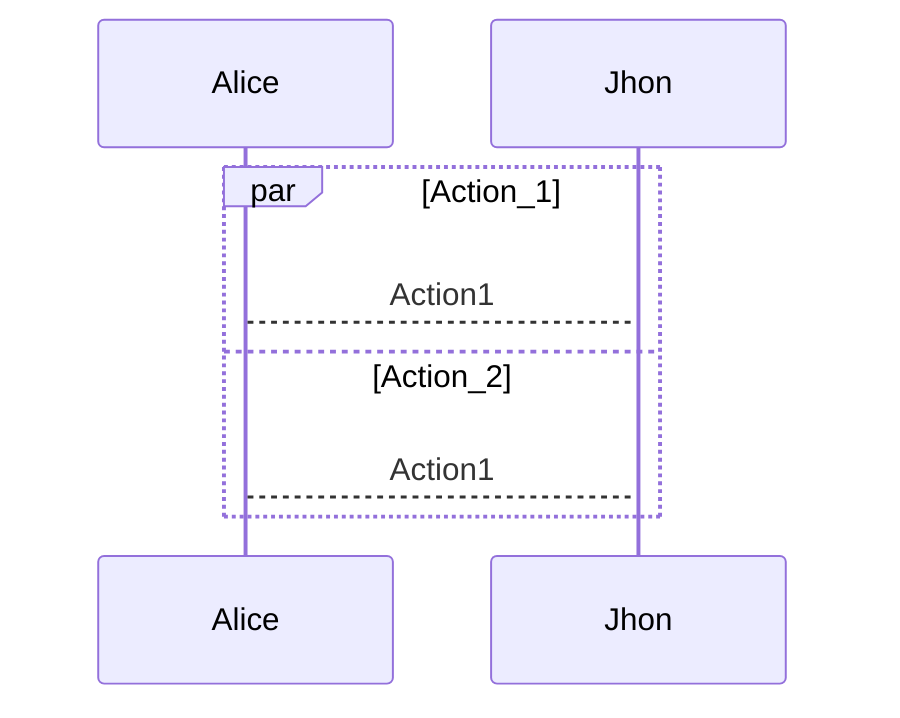
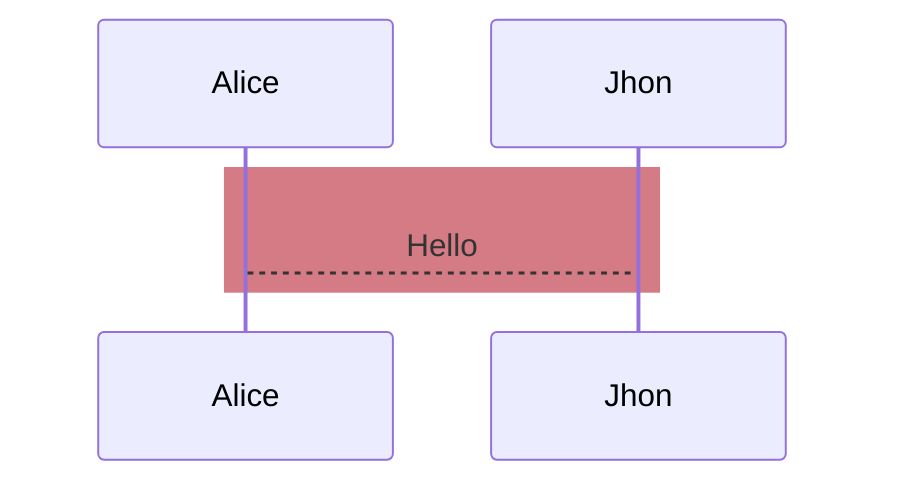
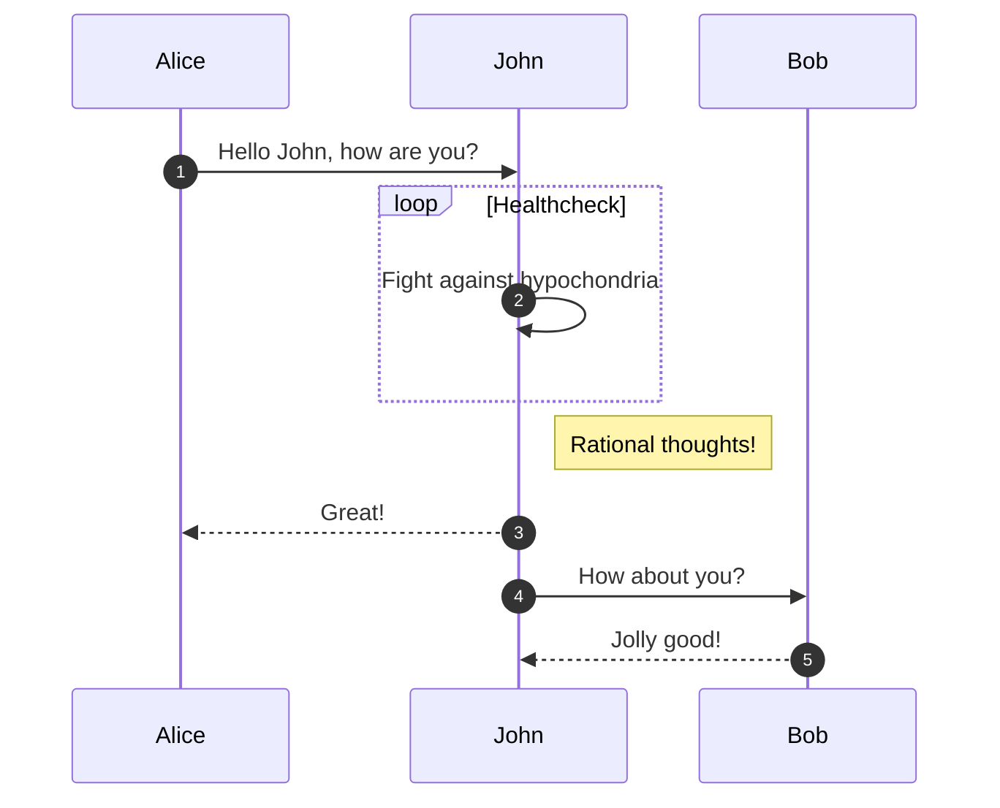

[返回](../Mermaid.md)

# `SequenceDiagram`

> 关键字 `end` 使用是可能导致破坏图表
>
> 如果一定要使用，请使用 `()` 或 `[]` 或 `""` 将单词包裹起来


### 语法

`sequenceDiagram`
`participant Alice`
`participant John`
`[Actor][Arrow][Actor]:Message text`



### 取别名

`sequenceDiagram`
`participant A as Alice`
`participant B as John`
`A->>B:Hello`
`B-->>A:Hi`


### 矢

- `->`

  ```mermaid
  sequenceDiagram
  participant Alice
  Alice -> Alice:Hello
  ```

  

- `-->`

 ```mermaid
  sequenceDiagram
  participant Alice
  Alice --> Alice:Hello
 ```


- `->>`

 ```mermaid
  sequenceDiagram
  participant Alice
  Alice ->> Alice:Hello
 ```


- `-->>`

 ```mermaid
  sequenceDiagram
  participant Alice
  Alice -->> Alice:Hello
 ```

- `-x`

 ```mermaid
  sequenceDiagram
  participant Alice
  Alice -X Alice:Hello
 ```

- `--X`

 ```mermaid
  sequenceDiagram
  participant Alice
  Alice --X Alice:Hello
 ```

> 使用单向箭头来表示消息：
>
> 实线代表主动发出消息
>
> 虚线代表响应
>
> 末尾带`x`代表异步消息，无需等待回应





### 激活

激活框代表消息处理时的时间间隔

- 使用关键字

`(de)activate [Actor]`

- 使用符号
  - `+ == activate`
  - `- == deactivate`

> 注：消息发出者不能设置非激活状态


### 标注

- `Note right of [Actor]`
- `Note over [Actor],[Actor]`


### 循环

`loop Loop text`

`statements`

`end`




### 可替代路径

`alt Describing text`

`statements`

`else`

`state`

`end`


`opt describing text`

`statements`

`end`





### 展示并行发生事件

`par [Action]`

`and [Action]`

`statements`




### 背景加亮

`rect rgb(r,g,b)`

`content`

`end`




### 代码注释

`%%`


### 显示顺序

`autonumber`



 <script>       mermaid.initialize({         sequence: { showSequenceNumbers: true },       });     </script>


