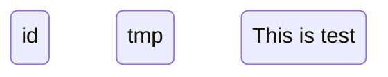
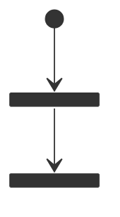
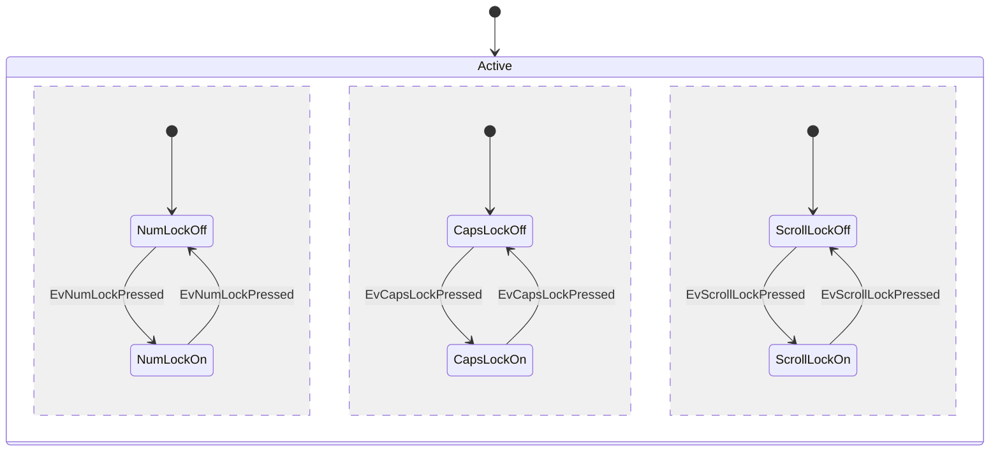

[返回](../Mermaid.md)

# StateDiagram

### 状态

`stateDiagram-v2`

`[stateName]` 或 `state ["stateName"] as [name]` 或 `[stateName]:[context]`

### 转移

`[state] --> [state]:[Note]`

### 开始和结束标志	

`[*]`

### 复合状态

`state [stateName]{[body]}`

### 分支与汇合

`<<fork>>` `<<join>>`

### 提示

`note [right] of [stateName]`

`statement`

`end note`

### 并发性

`--`

